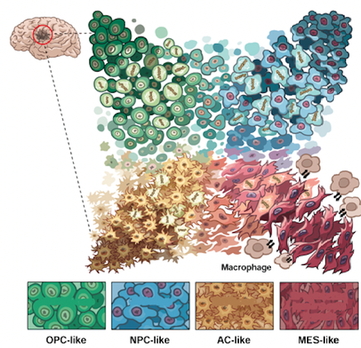

```{r setup, eval = TRUE,  cache=FALSE, include=FALSE}
# knitr::opts_knit$set(root.dir = workDir) ## = setwd()
knitr::opts_chunk$set(cache = FALSE,
                      fig.align   = 'center',
                      fig.cap = NULL,
                      fig.path= './figs/')
options(knitr.table.format = "html")
start.time = Sys.time()
```

# Libraries and environment

## Load environment

Libraries used to create and generate this report: 

```{r librariesEnvironment, echo = FALSE, message = FALSE, warning = FALSE}
library(rmarkdown)
library(knitr)
library(rmdformats)
library(bookdown)
library(kableExtra)
library(reshape2)
```

- R : ``r R.version$version.string``
- rmarkdown : ``r packageVersion("rmarkdown")``
- knitr : ``r packageVersion("knitr")``
- rmdformats : ``r packageVersion("rmdformats")``
- bookdown : ``r packageVersion("bookdown")``
- kableExtra : ``r packageVersion("kableExtra")``

## Load libraries

Libraries used for data analysis: 

```{r librariesAnalysis, message=FALSE, warning=FALSE, cache=FALSE, include=FALSE}
library(Seurat)
library(ggplot2)
library(BayesSpace)
library(SingleCellExperiment)
library(spacexr)
library(EnsDb.Hsapiens.v79)
library(CellChat)

## Plotting libraries
library(ggplot2)
library(GGally)
library(ggpubr)
library(clustree)
library(patchwork)
library(gridExtra)
library(grid)
```

- Seurat : ``r packageVersion("Seurat")`` for spatial transcriptomics (ST) data infrastucture
- BayesSpace : ``r packageVersion("BayesSpace")`` for spatially-constained clustering
- spacexr : ``r packageVersion("spacexr")`` for cell-type deconvolution (RCTD)
- CellChat : ``r packageVersion("CellChat")`` for cell-cell communication

```{r include=FALSE}
# add maximum memory requirements for the notebook to run fully
options(future.globals.maxSize = 3 * 1024^3)  # Set limit to 3 GiB (1 * 1024^2 bytes)
```

## Workshop directory

All the data and object for this workshop have been deposited in a shared space. Please, make sure you have copy this notebook in your personal directory.

```{r}
data.dir = "/projects/ws-celldyn/cavalli/data"
```


# Characterizing Glioblastoma with spatial transcriptomics (ST)

## Glioblastoma

Glioblastomas are the most common form of **malignant primary brain tumor** and an important cause of morbidity and mortality. In recent years there have been important advances in understanding the molecular pathogenesis and biology of these tumors, but this has not translated into significantly improved outcomes for patients. Glioblastoma is the most common brain tumor in patients older than 50 years old. 

Frequent alterations include copy number gains on chromosome 7 combined with copy number losses from chromosome 10, TERT promoter mutation, PTEN mutation and CDKN2A deletion. **Transcriptome-based studies** have stratified glioblastoma into classic, mesenchymal, proneural and neural tumours ([Verhaak et al., Cancer Cell, 2010](https://doi.org/10.1016/j.ccr.2009.12.020)). More recently, **single-cell studies** unravelled the **high intratumoral heterogeneity** of glioblastoma by describing **multiple tumor cell states** . Theses malignant cells exist in four main cellular states that recapitulate distinct neural cell types, are influenced by the **tumor microenvironment**, and exhibit plasticity ([Neftel et al., Cell, 2019](https://doi.org/10.1016/j.cell.2019.06.024)). 

```{r GBMTME, echo = FALSE, fig.align = "center", out.width = "70%", fig.cap=TRUE, fig.cap = "Glioblastoma microenvironment (from Indira Chandran, V., Gopala, S., Venkat, E.H. et al. npj Precis. Onc., 2024)"}
knitr::include_graphics("./pictures/GBM_TME.png")
```

However, single-cell studies are deprived from the **spatial arrangement** of cells. In an effort to circumvent this limitation, technologies able to preserve the spatial tissue context of RNA expression were recently developed and are grouped under the overarching term **spatial transcriptomics** (ST). These technologies, which enable to map RNA molecules within histological contexts, can be of two types: 

-	**Imaging-based**
-	**Sequencing-based**

As seen this morning during the lecture, imaging-based ST relies on the design of a panel with probes, which can hybridize transcripts from the tissue sample. The expression of the subset of targeted genes can then be measured by florescence at **high-resolution** (sub-cellular to single cell). Sequencing-based ST can measure the whole transcriptome relying on the capture of RNA on spatially barcoded microarrays slides followed by NGS, but at **lower resolution** (single to several cells).

Because of their differences of throughput and resolution, sequencing-based methods are more used in a hypothesis-generating purpose, while image-based ones are used for validation or in a hypothesis-driven way. 

In this workshop, the focus will be on unbiased exploration and hypothesis-generating approaches, as we will use one of the main sequencing-based ST technologies: Visium.

## Spatial transcriptomics (ST) with 10X Genomics Visium technology

Visium technology is a **sequencing-based** spatial profiling technology developed by 10x Genomics. This assay can take any frozen tissue, or mouse or human FFPE tissue sections on normal glass slides as input and will provide a whole transcriptome survey of the gene expression profiles across the tissue section. Resulting data will be **gene expression counts** value for each **spatial spot** (55 micron diameter, 100 micron from each other), which is overlayed over the **original tissue image**. While the current version does not provide single cell resolution, the whole transcriptome analysis across the entire interrogated tissue region will provide a relatively **unbiased survey of the spatially organized gene expression** in a given sample ([Office of Science and Technology Resources](https://ostr.ccr.cancer.gov/emerging-technologies/spatial-biology/)).

```{r Visium, echo = FALSE, fig.align = "center", out.width = "100%", fig.cap=TRUE, fig.cap = "Visium Spatial Transcriptomics from 10X Genomics"}
knitr::include_graphics("./pictures/Visium-gene-expression.png")
```

<details>
  <summary style="color: blue;"> **Click** to learn more about probe design </summary>
  <p>
  Visium probes for fresh-frozen samples are species and gene agnostic. It means that the slide can be used with any type of tissue with sufficient RNA quality. The probes are designed in four parts:

- Poly(dT) (in blue): a chain of thirty T nucleotide to which the polyA tail of mRNA will hybridize (mRNA capture). It serves as a backbone to cDNA amplification. 
- UMI (in orange): It stands for Unique Molecular Identifier. It is a unique 12 nucleotide-long barcode that will identify a captured mRNA. It is particularly helpful for the exact quantification of mRNA. Visium workflow contains a PCR amplification. Such UMI allows to identify which mRNA are unique and which are solely PCR duplicates. 
- Spatial Barcode (in green) : This spatial barcode is 16 nucleotide long and is common to all the probes belonging to the same spot. It allows to map back mRNA to their spatial location. 
- Partial Read 1 (in black): it corresponds to Illumina TruSeq sequencing primer.

In the Visium version for FFPE samples, the Poly(dT) is replaced by gene-specific probes designed to cover the whole genome. However, since the probe panel needs to be designed, it is only available for human and mouse at the moment. 
  </p>
</details>

## Objectives of the workshop 

In this session, we will delve into the analysis of 10X Visium ST data to decipher the intratumoral heterogeneity of glioblastoma. We will: 

1) Get familiar with Visium data format and infrastructures to perform data analysis
2) Perform clustering of spatial data and compare two frameworks of clustering
3) Perform cell-type deconvolution to unravel cell-type distribution 
4) Decipher cell-cell communication from spatial data


**Dataset**

10X Genomics makes available datasets generated with their different platforms. These datasets can be freely used and explored at [https://www.10xgenomics.com/datasets](https://www.10xgenomics.com/datasets) for method development, data analysis or education purposes. [The Cavalli's lab](https://institut-curie.org/team/cavalli) focuses on brain tumor heterogeneities. We have thus picked for this workshop a GBM slide generated with Visium v1: [https://www.10xgenomics.com/datasets/human-glioblastoma-whole-transcriptome-analysis-1-standard-1-2-0](https://www.10xgenomics.com/datasets/human-glioblastoma-whole-transcriptome-analysis-1-standard-1-2-0). These data are already pre-processed from sequencing to genome alignment with `10X Genomics spaceranger` algorithm which allows to obtain the spatial raw gene count matrix. 


# Investigating data format

## Data structure and summary
To begin, we need to load the spatial transcriptomics dataset from the 10X Genomics Visium platform. This dataset contains gene expression information mapped to spatial coordinates within a tissue section. We will use `Seurat` package as the main data infrastructure for the workshop. Documentation on the package is available at: [https://satijalab.org/seurat/](https://satijalab.org/seurat/).  

```{r}
GBM_slide <- Load10X_Spatial(data.dir = paste0(data.dir,"/GBM_visium/"),
                             filename= "Parent_Visium_Human_Glioblastoma_filtered_feature_bc_matrix.h5", 
                             slice = "GBM_img")#name of the image
```

Next, we examine the summary of the dataset by looking at associated metadata:

```{r}
metric_summary <- read.csv(paste0(data.dir,"/GBM_visium/Parent_Visium_Human_Glioblastoma_metrics_summary.csv"))
as.data.frame(metric_summary)
```

We can also inspect different components of the data:

- Count Data: Gene expression levels at each spatial location.
- Metadata: Information about each spatial barcode, including quality control metrics.
- Spatial Information: Coordinates of spatial barcodes within the tissue image.


```{r}
# Count data
head(GBM_slide@assays$Spatial@cells@.Data) # this layer contains the spot names, usually called by their spatial barcode (and, in case of multiple samples regrouped in the same object, an extra identifier, here 1, to make names unique)
head(colnames(GBM_slide)) # the spot identifier can also be accessed with simply colnames

head(GBM_slide@assays$Spatial@features@.Data) #this layer contains the gene names
head(rownames(GBM_slide)) # they can also be accessed like this

head(GBM_slide@assays$Spatial@layers$counts, c(5,10)) # Count data are highly sparse (lots of 0) and thus store in a sparse matrix

# Metadata
head(GBM_slide@meta.data)

# Spatial information 
head(GBM_slide@images$GBM_img@boundaries$centroids)
```


## Quality control

Quality control is an essential step in spatial transcriptomics analysis to ensure that low-quality spots (barcodes) are identified and possibly removed. We visualize some QC metrics:

- nCount_Spatial: Total counts of RNA molecules per spatial barcode.
- nFeature_Spatial: Number of unique genes detected per barcode.


```{r fig.height=5, fig.width=15}

QC_1 <- SpatialFeaturePlot(GBM_slide, features="nCount_Spatial",alpha=0) +NoLegend()
QC_2 <- SpatialFeaturePlot(GBM_slide, features = "nCount_Spatial")+
  theme(legend.key.size = unit(1,"cm"),legend.title = element_text(size = 10))
QC_3 <- SpatialFeaturePlot(GBM_slide, features = "nFeature_Spatial")+theme(legend.position = "top")+
  theme(legend.key.size = unit(1,"cm"),legend.title = element_text(size = 10))

QC_1+QC_2+QC_3

```


This allows us to assess potential low-quality spots that may require filtering.

**Question: Do you see any low-quality area in this sample? **

<details>
  <summary style="color: blue;"> **Click** to learn more about the filtering  of spatial data </summary>

  When observed, low quality spots can be filtered out. Like in single-cell data analysis, we can use several indicators to filter:
  
- spot with low number of count retrieved, 
- spot with low number of gene detected, 
- the percentage of mitochondrial genes, which is often used a proxy for cell deterioration. 
  
  Interestingly, with spatial transcriptomics, we can also implement quality control and filtering based on the image. The eye of the pathologist allows the identification of damaged areas and reflecting technical artefact (fold in the tissue, tears, holes etc.). 
  
</details>


## Visualizing spatial gene counts

Gene expression data is mapped back to the tissue image to visualize gene activity in a spatial context. Here we will take a look at the raw gene counts of 4 relevant genes for glioblastoma:

```{r fig.height=5, fig.width=20}
genes_of_interest <- c("GFAP", "OLIG2", "EGFR", "MKI67")
spatial_genes <- SpatialPlot(GBM_slide, features = genes_of_interest, slot="counts", image.alpha = 0.7, ncol = 4)
spatial_genes
```


```{r fig.height=10, fig.width=20}
malignant_genes <- c("VEGFA", "AQP1", "SOX10", "ATRX", "EFEMP1", "CNTD1", "GAP43", "INA")
SpatialPlot(GBM_slide, features = malignant_genes, slot="counts", image.alpha = 0.7, ncol = 4)

```


**Question: Are you more familiar with ST data structure now?**

# Normalization of ST data

An essential first step in the analysis of ST data is normalization, whose main aim is to make expression counts comparable within and between spots. The number of reads obtained from a spot could reflect its cellular content or technical variation in RNA capture and amplification. Thus, whether read count normalization is warranted in the context of ST remains an open question. Many normalization methods originally developped for single-cell RNA-sequencing (scRNA-seq) have been used for spatial transcriptomics (like SCTransform or log-normalization) and news ones have been proposed to include the spatiality of the data or the images (like [stSME](https://stlearn.readthedocs.io/en/latest/tutorials/stSME_comparison.html)). 

## Normalization

Raw sequencing data must be normalized to account for differences in sequencing depth and technical variability. We use SCTransform from [Seurat](https://satijalab.org/seurat/) package, an improved normalization method.

```{r message=FALSE, warning=FALSE}
GBM_slide <- SCTransform(GBM_slide, assay = "Spatial", verbose = FALSE)
```
<details>
  <summary style="color: blue;"> **Click** to learn more about SCTransform </summary>

**SCTransform (SCT)** (Hafemeister, C., Satija, R., Genome Biol 20, 296 (2019). [https://doi.org/10.1186/s13059-019-1874-1](https://doi.org/10.1186/s13059-019-1874-1ƒ)) is a method for normalization and variance stabilization of scRNA-seq data introduced by Seurat. It first identifies highly variable genes. It uses the Pearson residuals from a regularized negative binomial regression, where cellular sequencing depth is utilized as a covariate in a generalized linear model. Variation in sequencing depth is not a confounding factor anymore after SC Transformation. Additional variable features are less likely to be driven by technical differences across cells and instead may represent more subtle biological variability.

According to its authors, it does a better job in normalization than regular log-normalization, especially for highly expressing genes. It is particularly well-suited for situations where you are looking for cell types, that have very small differences and that you need to separate.

</details>


## Dimensionality reduction 

### Principal component analysis

Dimensionality reduction helps identify major sources of variation in the dataset, making subsequent analysis (e.g., clustering) more effective. We first apply PCA and compute the top 50 PCs (`npcs` means number of PCs) :

```{r message=FALSE, warning=FALSE}
GBM_slide <- RunPCA(GBM_slide, assay = "SCT", verbose = FALSE, npcs=50) # we compute 50 principal components
pca_df <- as.data.frame(GBM_slide@reductions$pca@cell.embeddings)
GBM_slide@meta.data[,paste0("PCA_", seq(1:50))] <- pca_df
```

We visualize the first five principal components:

```{r fig.height=10, fig.width=15}
# Visualize PCA score
GGally::ggpairs(pca_df, columns = 1:5)
```

And see how these components distribute spatially:

```{r fig.height=10, fig.width=15}
# In Space
SpatialPlot(GBM_slide, features = c("PCA_1", "PCA_2", "PCA_3", "PCA_4", "PCA_5", "PCA_6"))
```

<details><summary style="color: blue;"> **Click** to learn more on picking a number of PCs for subsequent analysis </summary>

To overcome the extensive technical noise in any single feature for spatial data (also true for scRNA-seq data), Seurat clusters spot based on their PCA scores, with each PC essentially representing a ‘metafeature’ that combines information across a correlated feature set. The top principal components therefore represent a robust compression of the dataset. However, how many components should we choose to include? 10? 20? 100?

One approach is to generate an 'elbow plot': a ranking of principle components based on the percentage of variance explained by each one. The idea is to select a restricted number of component that maximizes the variance explained. Depending on the dataset, the number of PCs may vary. 

```{r fig.height=5, fig.width=5}
ElbowPlot(GBM_slide, ndims = 50, reduction = "pca") # we show the ElbowPlot for all the computed PCs.
```

In our dataset, we can see that PC1 explains about 17% of the variance in our dataset. We then see that past 20, adding more PCs only slightly increase the explained variance. We will thus select 20 PCs to carry out clustering and 2D representation with UMAP. 

</details>

### Uniform Manifold Approximation and Projection (UMAP)

UMAP is a non-linear dimensionality reduction technique that preserves the local structure of the data, making it useful for visualizing clusters in spatial transcriptomics data.

```{r message=FALSE, warning=FALSE}
GBM_slide <- RunUMAP(GBM_slide, reduction = "pca", dims = 1:20) #parameter dims (number of dimensions) to select the top 20 PCs
DimPlot(GBM_slide, reduction = "umap", label = FALSE, cols = "black") + NoLegend()

```
Each point represents a spot on the UMAP.

It is also handy to visualize some gene expression in the reduced dimensional space:

```{r fig.height=10, fig.width=20}
FeaturePlot(GBM_slide, features = malignant_genes, ncol = 4)
```


# Spatial and non spatial clustering 

## Introduction to clustering

As you have seen in the single-cell omics workshop, clustering algorithm allows to identify cells with similar gene expression profiles. Applied to spatial transcriptomics, clustering is used to identify spatial domains, i.e spots with same gene expression profiles. 
However, with ST data, coordinates are also now available. **The First Law of Geography**, according to Waldo Tobler, is "everything is related to everything else, but near things are more related than distant things.". This concept can thus be translated to ST data as they are geographic data. 
A lot of different clustering methods have been developped to integrate the coordinates and favor the belongness of a spot to the same cluster as its neighbors. It is particularly useful in tissue with well defined spatial patterns such as the brain layers or the germinal centers. 

```{r clustering, echo = FALSE, fig.align = "center", out.width = "150%", fig.cap = "Benchmarking clustering, alignment, and integration methods for spatial transcriptomics (Hu Y. et al., Genome Biology, 2024)"}


```

Benchmarks of clustering algorithms starts to emerge. They show that there is a high diversity of methods which can use count data but also the spatial context and the image, to perform such tasks. Interestingly, [Cheng A. et al., Brief. Bioinfo. (2023)](https://academic.oup.com/bib/article/24/1/bbac475/6835380) shows that Seurat-based clustering methods, while not implementing any spatial prior, performs best on Visium data. More recent benchmarks highlight that methods' performances can be technology-biased, with some methods performing best on sequencing-based ST or imaging-based ST ([Hu, Y., Xie, M., Li, Y. et al., Genome Biology, 2024](https://doi.org/10.1186/s13059-024-03361-0)).

In this part of the workshop, we will test **two types of clustering algorithms**. The first one is the classic Louvain clustering implemented in the Seurat pipeline for single-cell data. The second one is `BayesSpace`, a spatially-constrained clustering algorithm taking into account the spots' coordinates. We will briefly compare the two outcomes in the context of cancer research. 

## Classical Louvain clustering

This classic implementation is divided in two steps:

  1. First, identify the "neighbors", which means the spot sharing the most transcriptomic similarity (this is not spatial neighbors!)
  
  2. Then, identify the clusters. 

```{r message=FALSE, warning=FALSE}
GBM_slide <- FindNeighbors(GBM_slide, reduction = "pca", dims = 1:20)
GBM_slide <- FindClusters(GBM_slide, verbose = FALSE)
```

We can visualize clustering results on the UMAP representation as well as on the spatial plot. 

```{r fig.height=5, fig.width=10}
DimPlot(GBM_slide, reduction = "umap", label = FALSE) + NoLegend()+
  SpatialPlot(GBM_slide, group.by = "seurat_clusters")
```

We can run the clustering algorithm at multiple resolution. Indeed, finding the right resolution of clustering requires investigation. Here, we propose to vary the `resolution` parameter and observe how the spots are distributed among clusters with resolution. 

```{r fig.height=10, fig.width=25}
# Run clustering at multiple resolutions
GBM_slide <- FindClusters(GBM_slide, verbose = FALSE, algorithm = 1, resolution=c(0.2,0.4,0.6,0.8,1,1.2)) 
p_umap = DimPlot(GBM_slide, group.by = "SCT_snn_res.0.8")
  
#Plot clustree and spatial plots on several resolutions
p_clustree = clustree(GBM_slide)
resolutions = paste0("SCT_snn_res.",c(0.2,0.4,0.6,0.8,1,1.2))

cluster_plot_list <- list()
for (res in resolutions){
  p= SpatialDimPlot(GBM_slide, group.by =res, label = F) + NoLegend() +labs(title=res)
  cluster_plot_list[[res]]=p
}
  
# Arrange all plots and save 
(p_clustree) | ((cluster_plot_list[[1]]|cluster_plot_list[[2]]|cluster_plot_list[[3]])/(cluster_plot_list[[4]]|cluster_plot_list[[5]]|cluster_plot_list[[6]])) +
    plot_layout(width = c(1,1), heights = c(1,2)) + 
    plot_annotation(title=paste0("Clustering results"),subtitle ="PCA on 3000 HVG followed by SNN and Louvain cluster computations" )

```

Ideally, we can choose a resolution when the number of cluster is stabilized or the sub-clusters are not 'necessary'. With spatial transcriptomics, we can lead further analysis to pick the number of clusters: 

- If the resolution increases, do I still recover differentially expressed gene between the cluster? 
- Do my clusters correspond to histological areas ? 

For the sake of time of the workshop, we will not go further in the analysis. We can pick a resolution at 0.4 or 0.6 here. Interestingly here, we still retrieve highly spatially-coherent clusters even though the clustering method is not taking into account the coordinates. 

## One example of spatially-constrained algorithm: BayesSpace

BayesSpace is a fully Bayesian statistical method that uses the information from spatial neighborhoods for resolution enhancement of spatial transcriptomic data and for clustering analysis. It first represents gene expression in a low-dimensional space (PCA) and assigns spots to clusters based on a fixed-precision model. Clustering is initialized using non-spatial methods like mclust and refined through Gibbs sampling and the Metropolis–Hastings algorithm. A Potts model enforces spatial smoothing, promoting neighboring spots to belong to the same cluster.

If you want to know more on the statistical model behind, we encourage you to read the article: Zhao, E., Stone, M.R., Ren, X. et al. **Spatial transcriptomics at subspot resolution with BayesSpace **. Nat Biotechnol 39 1375–1384 (2021), [https://doi.org/10.1038/s41587-021-00935-2](https://doi.org/10.1038/s41587-021-00935-2).

```{r Banksy, echo = FALSE, fig.align = "center", out.width = "100%", fig.cap = "Spatial transcriptomics at subspot resolution with BayesSpace (from Zhao, E., Stone, M.R., Ren, X. et al. Nat Biotechnol, 2021)"}


```


### Implementation of BayesSpace

BayesSpace relies on another type of data infrastructure called [`SpatialExperiment`](https://github.com/drighelli/SpatialExperiment) and need log-normalized gene expression. We thus implement this pre-processing steps. 

```{r}
# Read data in SCE format
sce <- read10Xh5(
  paste0(data.dir,"/GBM_visium"), 
  fname = "Parent_Visium_Human_Glioblastoma_filtered_feature_bc_matrix.h5")

# Pre-process the data with bayesSpace pipeline
sce <- spatialPreprocess(sce, platform="Visium", 
                              n.PCs=20, n.HVGs=3000, log.normalize=TRUE) 

```

#### Selecting the number of clusters

We can use the qTune() and qPlot() functions to help choose q, the number of clusters to use in our analysis.

- qTune() runs the BayesSpace clustering algorithm for multiple specified values of q (by default, 3 through 7) and computes their average pseudo-log-likelihood. It accepts any arguments to spatialCluster().

- qPlot() plots the pseudo-log-likelihood as a function of q; we suggest choosing a q around the elbow of this plot.

```{r message=FALSE, warning=FALSE}
sce <- qTune(sce, qs=seq(2, 10), platform="Visium", d=20) 
#parameter d: number of top principal components to use when clustering.
#parameter qs: possible number of clusters

qPlot(sce)
```

We pick q=7 as it is approximatively the elbow of the curve.

#### Clustering with optimal resolution
```{r message=FALSE, warning=FALSE}
set.seed(3108)
sce <- spatialCluster(sce, q=7, platform="Visium", d=20,
                           init.method="mclust", model="t", gamma=2,
                           nrep=10000, burn.in=100,
                           save.chain=TRUE)

clusterPlot(sce)
```


## Comparison of spatial and non spatial clustering

We can compare the results of the two clustering results. Here, we can choose 0.4 for the clustering resolution of the Seurat algorithm since it yielded approximatively the same number of clusters than BayesSpace with q=7. 

```{r}
# Retrieve clustering results from BayesSpace and add them to Seurat object
cluster_results <- colData(sce)[,c("barcode","cluster.init","spatial.cluster")]
seurat_metadata <- GBM_slide@meta.data
seurat_metadata$barcode <- rownames(seurat_metadata)

new_metadata <- as.data.frame(merge(seurat_metadata,cluster_results, by="barcode"))
rownames(new_metadata) <- new_metadata$barcode
GBM_slide@meta.data <- new_metadata
```

```{r fig.height=5, fig.width=10}
SpatialPlot(GBM_slide, group.by = "SCT_snn_res.0.4") + SpatialPlot(GBM_slide, group.by = "spatial.cluster")
```

**Question: Do you see any differences between spatial and non-spatial clustering? Do you think one is more adequate than another in the context of GBM?**


# Deconvolution of ST data

## A resolution problem with sequencing-based ST

Sequencing-based ST technologies have the important advantage of reaching transcriptome-wide coverage. However, most sequencing-based spatial technologies still fall short of single-cell resolution. Technologies such as Visium v1/v2 present **multiple cells within each spots**, limiting the ability to depict single-cell transcriptomes accurately in situ. While newer technologies such as Visium HD offer in principle sub-cellular resolution, their fine-grained layout and high dropout level currently require the aggregation of capture areas to work with the expression of a reasonable number of genes per aggregated zone.

To address the resolution challenge encountered in sequencing-based spatial technologies, a plethora of methods have been developed for deconvolution, which **resolves transcriptomic signals into contributions from individual cell types**, thus enhancing resolution and providing insights into cell-type-specific contributions at each spatial location. These methods typically **output proportions of cell types at each spatial location**.


## The expanding toolbox of deconvolution methods for ST

Many tools use advanced statistical methods for cell-type deconvolution, which can be categorized by their mathematical frameworks: regression, dimensionality reduction, bayesian, optimal transport and deep learning techniques. Each framework comes with its characteristics and limitations, and the most suitable approach is dependent on specific data characteristics and research goals.


```{r deconvolution-tree, echo = FALSE, fig.align = "center", out.width = "75%", fig.cap = "The expanding toolbox of deconvolution methods for ST (Gaspard-Boulinc, L., Gortana, L. et al., Nature Reviews Genetics (in press))"}

```


Most deconvolution methods for ST data rely on cell-type specific expression profiles to determine spatial cell-type distributions. These profiles are commonly available from scRNA-seq studies and community-curated atlases. Additionally, spatial localization of transcripts, along with stained tissue images can offer valuable information for deconvolution.

The sheer number of methods has made comprehensive benchmarking impractical. Published benchmarking studies have highlighted that the performances vary significantly depending on the ST technology, the number of genes captured and selected, the number of spots, and the number of cell types considered. Current results show that RCTD and Cell2location are top performers, but the number of benchmarked methods to date is limited and most deep-learning methods have not yet been benchmarked (([Li H. et al., Nat Commun, 2023](https://doi.org/10.1038/s41467-023-37168-7)), ([Li, B. et al., Nat Methods, 2022](https://doi.org/10.1038/s41592-022-01480-9)), ([Yan, L. et al., Bioinformatics, 2023](https://doi.org/10.1093/bioinformatics/btac805)), ([Chen, J. et al.,Brief Bioinform, 2022](https://doi.org/10.1093/bib/bbac245))).

For the workshop, we propose to implement state-of-the-art method RCTD (Robust Cell Type Deconvolution) and compare the results to established GBM metaprograms (see below). 

## One example: deconvolution with RCTD 

Each pixel in Visium data is a mix of genes that comes from different cells that can be of different cell-types. Among the methods reported in the benchmarks, RCTD (Robust Cell Type Deconvolution) is one of the top performers. RCTD is a statistical model that can be broken down in 4 major steps:

1. Learning cell type profiles from reference data (supervised learning step)

    RCTD first uses a separate dataset where we already know which cell types exist (single-cell RNA sequencing data).
    RCTD measures the average gene expression for each cell type. This acts like a "reference fingerprint" for each cell type.

2. Selecting the most important genes

    Some genes vary a lot between cell types, while others are not very useful for distinguishing them.
    RCTD filters out genes that don't provide much information and keep only the most informative ones.

3. Correcting for technical bias ("platform effects")

    Different experiments introduce noise and technical differences.
    To adjust for this, RCTD estimates and corrects for these biases before analyzing the data.

4. Estimating cell type proportions in each pixel (main RCTD step)

    The corrected data and reference fingerprints are used to estimate the proportion of each cell type in each pixel.
    This is done using a statistical model that takes into account:

        - The total gene expression in each pixel.
        - The estimated reference fingerprints.
        - Random noise to account for natural variability.
        
If you want to know more on the statistical model behind, we encourage you to read the article: Cable, D.M., Murray, E., Zou, L.S. et al. **Robust decomposition of cell type mixtures in spatial transcriptomics**. Nat Biotechnol 40, 517–526 (2022), [https://doi.org/10.1038/s41587-021-00830-w](https://doi.org/10.1038/s41587-021-00830-w).

```{r rctd, echo = FALSE, fig.align = "center", out.width = "75%", fig.cap = "Deconvolution with Robust Cell-Type Decomposition (RCTD) (Cable, D. et al., Nat Biotechnol., 2022 "}

```


### Reference-dataset: a subset of GBMap

RCTD is a **reference-based** method which means it performs cell-type deconvolution for Visium data by using a single-cell reference. The single-cell reference choice is crucial. Such reference needs to be comprehensive, i.e. to contain all the cell-types that may appear in your spatial data, and representative, i.e. there is a sufficient number of cell per cell type to learn an average profile. 

For the workshop, we will use the **GBmap**, an atlas of glioblastoma and a curated resource that harmonizes 16 datasets across 110 patients and spanning over 330 thousand cells ([Web explorer](https://cellxgene.cziscience.com/collections/999f2a15-3d7e-440b-96ae-2c806799c08c), [Ruiz-Moreno, C. et al, bioRxiv, 2022](https://www.biorxiv.org/content/10.1101/2022.08.27.505439v1)).

```{r}
GB_map <- readRDS(paste0(data.dir,"/GB_map/GB_map_seurat.rds"))
GB_map
```

The GBmap can be dowloaded directly as a Seurat object. The data are stored in the same format as spatial data, without the image and the coordinates that are not available for such data type. To note: the downloaded data are in `Seurat` v4 whereas we used `Seurat` v5 for the spatial object. The package still support the two versions of data format but the command are slightly different. 

```{r}
head(GB_map@assays$RNA@counts) # access count data
head(colnames(GB_map)) # access cell name, remark the unique identifier changed from the barcode to patient identifier_cell number
head(rownames(GB_map)) # here, gene names are stored as ENSEMBL ids.
head(GB_map@meta.data) #all the metadata provided by the authors
```


ScRNA-seq studies have shown that several subtypes may exist simultaneously in different region of the same tumor and that molecular clusters can change over time and through therapy. The combination of single-cell seq and TCGA analysis, demonstrates that in GBM, there exists 4 cellular states that are reminiscent of canonical neurodevelopmental cell types: 1) neural-progenitor-like (NPC-like); 2) oligodendrocyte-progenitor-like (OPC-like); 3) astrocyte-like (AC-like), and 4) mesenchymal-like (MES-like) ([Neftel et al., Cell, 2019](https://doi.org/10.1016/j.cell.2019.06.024)). As a result, each tumor turns out to be composed of cells that are in multiple cellular states and the tumor microenvironment could affect the transition among these different conditions or proliferation.

```{r GBMcellstates, echo = FALSE, fig.align = "center", out.width = "75%", fig.cap = "Glioblastoma cell states defined by Neftel et al.  (2019) "}

```

To date, the spatial organization of the different malignant cell states and their relationships within the microenvironment has not been investigated with cell-type deconvolution and spatial transcriptomics. The first study of GBM by Visium addressed this challenge by defining spatial neighborhoods, but without resolving them to individual cell states and their organization ([Ravi VM, Will P, Kueckelhaus J, et al., Cancer Cell, 2022](https://www.doi.org/10.1016/j.ccell.2022.05.009)). In their recent article, ([Greenwald et al., Cell, 2024](https://doi.org/10.1016/j.cell.2024.03.029)) unravelled a multi-layer architecture of GBM by building meta-programs, consensus programs that are robustly identified across several samples, further annotated as the different microenvironment components. 

By leveraging cell-type deconvolution with RCTD, we can aim at providing a fine-grained view of the organization only at the cell-type resolution. We will thus first investigate the reference dataset and select the best annotation level for the analysis to perform cell-type deconvolution. 

```{r referenceplot, fig.height=5, fig.width=10, message=FALSE, warning=FALSE}
Map_1 <- DimPlot(GB_map, reduction = "umap", group.by = "annotation_level_1") + theme(legend.position="bottom")
Map_2 <- DimPlot(GB_map, reduction = "umap", group.by = "annotation_level_2")+ theme(legend.position="bottom")

Map_1+Map_2
```

```{r fig.height=10, fig.width=10, message=FALSE, warning=FALSE}
Map_3 <- DimPlot(GB_map, reduction = "umap", group.by = "annotation_level_3")+ theme(legend.position="bottom")
Map_3
```


```{r}
sort(table(GB_map@meta.data$annotation_level_3))
```

### Implementation of RCTD (Robust Cell Type Deconvolution) 

First, RCTD creates a `Reference` object which consists in a sub-sampling of the scRNA-seq reference. Here, we will use a maximum of 2,500 per cell-type to speed up the computation. To note: some cell-types are underrepresented (for example, Neurons with only 22 cells). We have the choice to exclude them or to keep them in the reference. It is possible that deconvolution generates results that go against prior knowledge (like histological annotations). Such aberrant signal can come from the fact that there is not enough cells of a given cell type or enough genes in common between your reference and your spatial data to characterize well this cell-type.


```{r RCTD-ref}
# cell_types
cell_types <- GB_map@meta.data$annotation_level_3
levels(cell_types)[levels(cell_types) == "CD4/CD8"] <- "LTCD4-8" # "/" is a forbidden character
names(cell_types) <- colnames(GB_map)

# Convert ENSEMBL gene ids in gene symbol since in the reference they are stored as ENSEMBL IDs and we want gene symbols
ensembl.genes <- rownames(GB_map)
geneIDs1 <- ensembldb::select(EnsDb.Hsapiens.v79, keys= ensembl.genes, keytype = "GENEID", columns = c("SYMBOL","GENEID"))
geneIDs1$SYMBOL <- make.unique(as.character(geneIDs1$SYMBOL), sep = ".") # some gene symbols are duplicated but with different ENSEMBL ids. We still want to keep them. 


# Counts: subset to genes with gene SYMBOL found
ref_counts <- GB_map@assays$RNA@counts
ref_counts <- ref_counts[rownames(ref_counts) %in% geneIDs1$GENEID,]
rownames(ref_counts) <- geneIDs1$SYMBOL

# Build the reference
reference <- Reference(ref_counts, cell_types, n_max_cells=2500) # The Reference() function creates a S4 class object to represent scRNA-seq data. It is the object used by RCTD to store these data. It only needs as input the raw scRNA-seq count data, the cell-type calling results and the maximum number of cells per cell-types. 

sort(table(reference@cell_types))

#saveRDS(reference, "./analysis/deconvolution/reference.RDS")
rm(GB_map) #to free some memory
```


Once the `Reference` object is prepared, we need to prepare the `SpatialRNA` object. It will contain the gene expression data (unormalized as required by RCTD) and the coordinates (but only for plotting purpose). 

To note, RCTD, while being a top performer, does not take into account the spatial relationships of the spots. Multiple methods since RCTD publication have integrated the coordinates, but we still lack some convincing benchmarking of a potential benefit of this addition, compared to using only the gene expression data.

```{r RCTD-Spatial}
DefaultAssay(GBM_slide) <- "Spatial"
# Retrieve the count data 
counts <- GBM_slide@assays$Spatial@layers$counts
rownames(counts) <- rownames(GBM_slide)
colnames(counts) <- colnames(GBM_slide)

# Retrieve the coordinates
coords <- as.data.frame(GBM_slide@images$GBM_img@boundaries$centroids@coords)
rownames(coords) <- colnames(GBM_slide)
colnames(coords) <- c("row", "col")

# Build object
RCTD_spatial <- SpatialRNA(coords, counts)
```

Finally, the algorithm is taking as input the reference and the spatial data to build an `RCTD.object` and infer cell-types proportions. RCTD propose several modes: 

- Singlet mode: find one cell-type per spot
- Doublet mode: find the one or two dominant cell-type per spot
- Full mode: compute the percentage without a constrained number of cell-type per spot

For our analysis, we will use the `full` mode because Visium spots have a large size, thus likely with several cells and cell-types. 

```{r deconvolution, message=FALSE, warning=FALSE}
# We will use the default parameters
myRCTD <- create.RCTD(RCTD_spatial, reference, max_cores = 1,CELL_MIN_INSTANCE = 20, #Since we have only 22 neurons
                      gene_cutoff = 0.000125, 
                      fc_cutoff = 0.5,
                      gene_cutoff_reg = 2e-04,
                      fc_cutoff_reg = 0.75,) 

## there is a lot of parameters to adjust ! 

myRCTD <- run.RCTD(myRCTD, doublet_mode = 'full')

#equivalent to run fitBulk, choose_sigma_c and fitPixels
# fitBulk : Estimates bulk cell type composition and uses this to estimate platform effects and normalize cell type proportions
# choose sigma : Estimates sigma_c by maximum likelihood
# fitPixels : Runs the RCTD algorithm. In full mode, can fit any number of cell types on each pixel.

#saveRDS(myRCTD, "./analysis/deconvolution/GB_RCTD_full.rds")
rm(reference)
rm(RCTD_spatial)
# rm(ref_counts)
```

We now have access to the deconvolution results. To ease representation, we will add them to the Seurat object.

```{r deconvolution_results}
RCTD_results <- myRCTD@results
norm_RCTD_results <- as.data.frame(normalize_weights(RCTD_results$weights))
cell_types <- colnames(norm_RCTD_results)
meta_data <- GBM_slide@meta.data
meta_data <- merge(meta_data, norm_RCTD_results, by=0)
rownames(meta_data) <- meta_data$Row.names
  
GBM_slide@meta.data <- meta_data
```


### Interpretation of the deconvolution results

Deconvolution results are structured as a matrix where, for each spot, a proportion represents the contribution of a cell-type to its overall composition. 

```{r}
norm_RCTD_results[1,]
```

As we showcase in the introductive part on cell-type deconvolution for GBM, few studies have adresse the distribution of the malignant cell states and of the TME cell-types by using deconvolution. We will thus first focus on the malignant states and show their spatial distribution.

```{r malignant-deconvolution, fig.height=5, fig.width=20}
malignant_cell_states <- c("AC-like", "NPC-like", "OPC-like", "MES-like")

SpatialPlot(GBM_slide, features = malignant_cell_states, ncol = 4) &
  guides(color = guide_legend(title.position = "top", title.hjust=0.5))
```

**Question: What can we say about the frequency and the spatial distribution of the malignant cell states in this GBM sample?**

The GBM microenvironment contains an array of non-neoplastic cells, including infiltrating and resident immune cells, vascular cells, and other glial cells. Particular emphasis has been placed on various non-neoplastic constituents of the immune system, especially tumor-associated macrophages (TAMs).

```{r immune-deconvolution, fig.height=10, fig.width=20}
immune_cell_states <- c("B cell", "LTCD4-8", "DC", "Mono", "NK", "Plasma B", "TAM-BDM", "TAM-MG")

SpatialPlot(GBM_slide, features = immune_cell_states, ncol = 4) &
  guides(color = guide_legend(title.position = "top", title.hjust=0.5))

```

We can also investigate how heterogeneous spots are, i.e. how many different cell-type can be found in each spot and if there are dominant cell-types or not. 

First, let's have a look at the score distribution across all spots for all cell-types: 
```{r fig.height=15, fig.width=15, message=FALSE, warning=FALSE}
# Convert data to long format manually
RCTD_long <- data.frame(
  Variable = rep(names(norm_RCTD_results), each = nrow(norm_RCTD_results)),  # Repeat column names
  Value = as.vector(as.matrix(norm_RCTD_results))  # Convert to vector
)

# Plot histograms using ggplot2
ggplot(RCTD_long, aes(x = Value)) +
  geom_histogram(bins = 30, fill = "steelblue", alpha = 0.7) +
  facet_wrap(~ Variable, scales = "free") +
  theme_minimal() +
  labs(title = "Distribution of cell-type deconvolution results", x = "Value", y = "Count")
```


Then, we can have a look at which cell-type dominates spots, and when they dominate what are their deconvolution proportions: 
```{r message=FALSE, warning=FALSE}
# Extract the maximum values to plot the distribution
max_scores <- apply(norm_RCTD_results, 1, max)
max_columns <- colnames(norm_RCTD_results)[apply(norm_RCTD_results, 1, which.max)]
maximum_ct <- data.frame(Max_Value = max_scores, Column_Name = max_columns)

# Plot the distribution 
ggplot(maximum_ct, aes(x=max_scores)) + geom_histogram()+
  facet_wrap(~ Column_Name, scales = "fixed") 
```

Finally, we can look at the median composition of spots dominated by the same cell-type: 

```{r fig.align='center', fig.height=15, fig.width=15, message=FALSE, warning=FALSE}
# Check which are the dominant cell types in each spot
norm_RCTD_results$Dominant <- colnames(norm_RCTD_results)[apply(norm_RCTD_results, 1, which.max)]
# Compute the average composition per dominant cell type
avg_composition <- aggregate(. ~ Dominant, data = norm_RCTD_results, median)
# Calculate the number of spots per dominant cell type
spot_count <- table(norm_RCTD_results$Dominant)
spot_count_df <- data.frame(Dominant = names(spot_count), Spot_Count = as.integer(spot_count))

# Reshape the data to long format
df_long <- melt(avg_composition, id.vars = "Dominant", variable.name = "Cell_Type", value.name = "Proportion")

# Merge the spot count with the long format data
df_long <- merge(df_long, spot_count_df, by = "Dominant")

# Order Dominant by Spot_Count in decreasing order and create a title including the Spot_Count
df_long$Title <- paste(df_long$Dominant, "- Spots:", df_long$Spot_Count)
df_long$Title <- factor(df_long$Title, levels = paste(names(sort(spot_count, decreasing = TRUE)), "- Spots:", sort(spot_count, decreasing = TRUE)))

# Plot the grouped bar chart with spot count in the facet title and ordered facets
ggplot(df_long, aes(x = Cell_Type, y = Proportion, fill = Cell_Type)) +
  geom_bar(stat = "identity", position = "dodge") +
  facet_wrap(~ Title, scales = "fixed") +  # Facets ordered by the number of spots
  labs(title = "Median composition of spots dominated by the same cell-type", x = "Cell Type", y = "Proportion") +
  theme(axis.text.x = element_text(angle = 45, hjust = 1))
```

We can observe from this plot that the majority of spot (top 3) are dominated by one cell-type which contribute to more than 30% of the spot composition. It is particularly true for spots dominated by the two tumor cell states, MES-like and AC-like. For the other spots (second and third line), the spots often contains quite heterogenous cell-type population where a truly dominating cell-type is hard to define. However, they constitute a minority of spots. 

## Comparison to scoring method

RCTD is using both a single-cell reference and the spatial data to unravel the cell-type contribution. It can be compared to the metaprogram built by [Greenwald et al. (2024)](https://www.cell.com/cell/fulltext/S0092-8674(24)00320-9?_returnURL=https%3A%2F%2Flinkinghub.elsevier.com%2Fretrieve%2Fpii%2FS0092867424003209%3Fshowall%3Dtrue) as they both aim to decipher cell-type distribution. Contrary to RCTD, the metaprograms have been built only from the spatial data, a process we can call **reference-free** (or unsupervised). Moreover, each metaprogram have a contribution in each spot as computed by the method used (NMF) but these contribution are not proportions as they do not sum to 1. 

We propose to load these metaprograms and, like in the original article, score the spots with `AddModuleScore` function for the different metaprograms. We will then be able to compare the metaprograms scores with the deconvolution results provided by RCTD. 

```{r warning=FALSE}
# Load MP from Greenwald et al. (2024)
Greenwald_MP <- readxl::read_excel(paste0(data.dir,"/Metaprograms/Greenwald.xlsx"))

Greenwald_MP
MP_names <- colnames(Greenwald_MP)
print(MP_names)

# Score
DefaultAssay(GBM_slide) <- "SCT"
GBM_slide <- AddModuleScore(GBM_slide, features = as.list(Greenwald_MP), name="MP_")
names(GBM_slide@meta.data)[grep("MP_", names(GBM_slide@meta.data))] <- MP_names

```


Here are the spatial plots comparing the malignant metaprograms (top) to the deconvolution results (bottom).

```{r MP_malig_plots, fig.height=10, fig.width=20}
malignant_MP <- c("AC (malig.)", "NPC (malig.)","OPC (malig.)","MES (malig.)")

SpatialPlot(GBM_slide, features=c(malignant_MP,malignant_cell_states), ncol = 4) 
```

**Question: Are the cell-type distributions different between the two approaches? You can also look at the other TME components.**

Interestingly, Greenwald at al., described other metaprograms that were not previously established in single-cell and potentially being unique to spatial. We can represent them the same way that the classical malignant states.

```{r MP_spatial, fig.height=10, fig.width=20}
spatial_only_malignant <- c("MES.Hyp (malig.)", "Prolif.Metab (malig.)", "MES.Ast (malig.)","Chromatin.reg (malig.)")
SpatialPlot(GBM_slide, features=c(spatial_only_malignant), ncol = 4)
```

**Question: Can you identify the advantages and disadvantages of the two methodologies?**

<details><summary style="color: blue;"> **Click** for elements of comparison of reference-based and reference-free approaches </summary>

<p>
- Reference-based deconvolution (like RCTD): *These methods use scRNA-seq data by modelling the gene expression in ST spots as a mixture of single-cell gene expression profiles from the scRNA-seq datasets or by representative gene expression profiles of specific cell types. These methods benefit from external reference datasets and therefore provide results coherent with prior knowledge of tissue composition deciphered through single-cell studies. However, these methods can propagate inaccuracies from the scRNA-seq data annotation to the ST analysis. Furthermore, they do not allow for novelty detection and rely on the assumption that the scRNA-seq data is fully representative for the ST data, which might not always be the case.*
</p>

<p>

- Signature scoring (like the metaprograms) and reference-free deconvolution approaches: *These approaches are based on technique to estimate gene programs. They analyze correlations and intrinsic variations in ST data and use factor decomposition to detect these gene programs. In the case of metaprograms as defined in Greenwald et al., the decomposition was done on multiple samples first and then comparative analysis was led to identify common gene programs further called metaprograms. Similar to this approach, reference-free deconvolution methods have been developped. These methods relies on the same techniques with the core assumption that the gene programs represent cell-types and the goal being to identify cell-type distribution. Yet, these factors are gene programs whose annotation by the user is highly dependent on the chosen database and may also reflect other biological processes. Reference-free methods are particularly interesting in discovery settings where tissues are not characterized at the single-cell level or to uncover new cell states but the results might not align well to prior knowledge as the inference of gene program is less constrained.*
</p>
</details>

## Comparison with clustering results

In scRNA-seq analysis, the clusters identified are very often cell types or cell-states. In spatial data, clusters are groups of spots with similar gene expression. However, the relationship between spatial clusters and cell-type is less evident. We can thus try to look in this sample if there is any relationships between spatial clusters and cell-type composition. 

```{r fig.height=10, fig.width=20}
# Attribute to each spot its dominant cell type to ease representation
# colnames(GBM_slide) == rownames(norm_RCTD_results) check they are similarly ordered
GBM_slide$Dominant <- norm_RCTD_results$Dominant
colors_dominant <- c("red", "blue", "darkgreen", "darkorchid4", "orange", "pink", "darkorchid1", "chocolate4", "black")
names(colors_dominant) <- c("AC-like", "Astrocyte", "Endothelial", "LTCD4-8", "MES-like", "Mural cell", "Neuron", "TAM-BDM", "NPC-like")

# Spatial Plot
p1 <- SpatialPlot(GBM_slide, group.by = "SCT_snn_res.0.4") + labs(title="Clustering results (non spatial)") 
p2 <- SpatialPlot(GBM_slide, group.by = "Dominant", cols = colors_dominant) + labs(title="Annotation of dominant cell-type per spot")

p1+p2
```


We can also interpret the clusters given their cell-type composition. 

```{r fig.height=20, fig.width=25}
cluster_res <- "SCT_snn_res.0.4"
Idents(GBM_slide) <- "SCT_snn_res.0.4"
VlnPlot(GBM_slide, features = cell_types, ncol = 5, alpha = 0.2) 
```

**Question: What can you say about the relationship between cell-type distribution and spot clustering?**


# Unravelling cell-cell communication 

Cell–cell interactions (CCI) orchestrate organismal development, homeostasis and single-cell functions. When cells do not properly interact or improperly decode molecular messages, disease ensues. Thus, the identification and quantification of intercellular signalling pathways has become a common analysis performed across diverse disciplines. The expansion of protein–protein interaction databases and recent advances in RNA sequencing technologies have enabled routine analyses of intercellular signalling from gene expression measurements of bulk and single-cell data sets. In particular, ligand–receptor pairs can be used to infer intercellular communication from the coordinated expression of their cognate genes ([Armingol, E., Officer, A., Harismendy, O. et al., Nat Rev Genet (2021)](https://doi.org/10.1038/s41576-020-00292-x)).

Various computational tools have been developed, each of which infer CCIs within a sample using known ligand and receptors. The core methods, like CellChat (Jin et al., Nat Commun 12, 1088 (2021), [https://doi.org/10.1038/s41467-021-21246-9](https://doi.org/10.1038/s41467-021-21246-9)), use the **expression levels of ligands and receptors** to elucidate how cells communicate.

If you are interested about the topic of CCIs, we encourage you to read the following review, which is very clear and extensive about the existing CCI inference tools: Armingol, E., Baghdassarian, H.M. & Lewis, N.E., **The diversification of methods for studying cell–cell interactions and communication**, Nat Rev Genet 25, 381-400 (2024). [https://doi.org/10.1038/s41576-023-00685-8](https://doi.org/10.1038/s41576-023-00685-8).


```{r CCC, echo = FALSE, fig.align = "center", out.width = "75%", fig.cap = "Analysis workflow for inferring cell–cell interactions and communication from gene expression (from Armingol et al., 2021)"}


```

Briefly, as a generic example, CCIs can be predicted as follows: 

1. Collection of samples/cells/spatial data for transcriptomics analysis,

2. Data pre-processing and generation of the expression matrix,

3. Building or using cell-cell communication database with know ligand-receptor interactions or protein-protein networks,

4. Gene expression matrix filtering to include only ligands and receptors pairs,

5. Computation of a **communication score** (formulation of the score depends on the method) with statistical testing for significance of the interaction,

6. Interpretation and visualization of the results.

As a result, computational tools enable the identification of important CCIs and the generation of biological hypotheses that can be experimentally evaluated. 

In the recent years, new tools emerged to address yet more complex nuances of intercellular interactions, for example using the expression of known target genes of ligand-receptor interactions to bring more support to the predictions. With the emergence of spatially-resolved technologies, methods have been adapted or newly developed leveraging the spatial coordinates of the spots and/or cells. The methodological advancement lies in including spatial context and in constraining or weighting CCI predictions for a better accuracy.   

We will implement one of the core tools to perform such analysis: `CellChat`. 

## CellChat

CellChat is a CCI tool which comprises two main modules: a **database** CellChatDB and a **model** to score the interactions. 

CellChatDB is a manually curated and literature-supported signaling molecule interaction database. CellChatDB not only incorporates the multisubunit structure of L–R complexes but also accounts for soluble and membrane-bound stimulatory and inhibitory cofactors such as agonists, antagonists and coreceptors. In addition, CellChatDB classifies each L–R pair into one of the functionally related signaling pathways (for example, WNT, BMP, CXCL and CCL) to construct cell–cell communication networks at a signaling pathway level, where each link of the network is computed by summing the interaction strengths of all associated L–R pairs.

To quantify communication between two cell groups mediated by a given ligand and its cognate receptor, CellChat leverages the **law of mass action** to associate each interaction with an interaction score, which is calculated based on the average expression values of a ligand by one cell group and that of a receptor by another cell group, as well as their cofactors. Significant interactions are identified based on a **statistical test** that randomly permutes the group labels of cells.

In its latest implementation, **CellChat is taking advantage of the spatiality of the data**. The model is able to take as input the coordinates and detect interaction across neighbors within a user-defined distance range. 


```{r cellchat, echo = FALSE, fig.align = "center", out.width = "100%", fig.cap = "General framework of CellChat "}

```


If you want to know more on the statistical model behind, we encourage you to read the following original articles detailing CellChat model: 

- CellChat v1: Jin, S., Guerrero-Juarez, C.F., Zhang, L. et al. **Inference and analysis of cell-cell communication using CellChat**. Nat Commun 12, 1088 (2021). [https://doi.org/10.1038/s41467-021-21246-9](https://doi.org/10.1038/s41467-021-21246-9)

- CellChat v2: Jin, S., Plikus, M.V. & Nie, Q. **CellChat for systematic analysis of cell–cell communication from single-cell transcriptomics**. Nat Protoc 20, 180–219 (2025). [https://doi.org/10.1038/s41596-024-01045-4](https://doi.org/10.1038/s41596-024-01045-4)


## Implementation of CellChat

When implementing CellChat for spatial, we need to attribute a cell-type for a spot. We saw in the last part that the majority of spots contain one dominant cell-type, particularly those dominated by malignant cell-type. Here, we will continue with such assumption. However, when applied to your own data, it is important to check this depending on your tissue type. 

### Prepare CellChat object
```{r}
# Prepare input data for CellChat analysis
# We have already isolated the counts data in the previous section 
#counts <- GBM_slide@assays$Spatial@layers$counts
#rownames(counts) <- rownames(GBM_slide)
#colnames(counts) <- colnames(GBM_slide)

# define the meta data: We saw that most spots contain a unique cell-type
meta_data <- GBM_slide@meta.data
meta_data$labels <- as.factor(apply(meta_data[, cell_types], 1, function(x) names(x)[which.max(x)]))
sort(table(meta_data$labels))

# Isolate the useful meta data
meta <- meta_data[,c("Row.names", "labels")]
meta$samples <- as.factor("GBM_visium")
meta <- meta[,-1]

# Spatial data
## Spatial locs
spatial.locs <- as.matrix(coords)
colnames(spatial.locs) <- c("imagerow", "imagecol")
## Sacle factor
### Of note, the 'spot_diameter_fullres' factor is different from the `spot` in Seurat object and thus users still need to get the value from the original json file. 
scalefactors = jsonlite::fromJSON(txt = file.path(paste0(data.dir,"/GBM_visium/spatial/scalefactors_json.json")))

spot.size = 65 # the theoretical spot size (um) in 10X Visium
conversion.factor = spot.size/scalefactors$spot_diameter_fullres
spatial.factors = data.frame(ratio = conversion.factor, tol = spot.size/2)

d.spatial <- computeCellDistance(coordinates = spatial.locs, ratio = spatial.factors$ratio, tol = spatial.factors$tol)
min(d.spatial[d.spatial!=0]) # this value should approximately equal 100um for 10X Visium data
# 99.42316

```


```{r}
# Prepare CellChat object
cellchat_obj <- createCellChat(object = counts, meta = meta, group.by = "labels",
                           datatype = "spatial", coordinates = spatial.locs, spatial.factors = spatial.factors)

cellchat_obj
```

### Set the Ligand-Receptor Database

```{r cellchatDb, fig.align = "center"}
CellChatDB <- CellChatDB.human # use CellChatDB.human if running on human data
showDatabaseCategory(CellChatDB)
```

We will exclude from the analysis the non-protein signalling here. 

```{r}
# Have a glimpse to the Database and how it is structured
dplyr::glimpse(CellChatDB$interaction)

# Exclude "Non-protein Signaling" from CellChatDB v1
CellChatDB.use <- subsetDB(CellChatDB) #Setting search = NULL & non_protein = FALSE will return all signaling except for "Non-protein Signaling".

# set the used database in the object
cellchat_obj@DB <- CellChatDB.use
```

### Pre-processing 

```{r}
# subset the expression data of signaling genes for saving computation cost
cellchat_obj <- subsetData(cellchat_obj) # Setting features=NULL (default) subset the expression data of signalling genes

cellchat_obj <- identifyOverExpressedGenes(cellchat_obj, do.fast = FALSE)
cellchat_obj <- identifyOverExpressedInteractions(cellchat_obj, variable.both = F)
```

### Infer communication networks

#### At the LR level

As previously mentionned, CellChat can compute the communication probabilities at two different levels. We will first compute it at the ligand-receptor level. 

```{r}
ptm = Sys.time()

cellchat_obj <- computeCommunProb(cellchat_obj, type = "truncatedMean", trim = 0.1,
                              distance.use = TRUE, interaction.range = 250, scale.distance = 0.01,
                              contact.dependent = TRUE, contact.range = 200)

print(paste0("Execution time (min): ", Sys.time() - ptm))

#saveRDS(cellchat_obj, file = "./analysis/cell_cell_communication/GBM_cellchat_obj.rds")
```

<details><summary style="color: blue;"> **Click** for details on 'ComputeCommunProb' function </summary>

To calculate the average gene expression per cell type, by default the function uses `triMean`. It is a 25% truncated mean, implying that the average expression is 0 if the % of expressing cells in one group is less than 25%. This ensures detecting fewer but stronger interactions. In this case, we also want to identify weaker signals, this is why we set `type = "truncatedMean"` and `trim = 0.1` instead of 0.25. We set `distance.use = TRUE` to take advantage of the spatial coordinates by indicating that the cell-cell communication probability is inversely proportional to the computed distance. For `interaction.range` (the maximum diffusion length of ligands in microns), we use the default value.
</details>

We can filter the interaction based on the number of spot with given cell-types. Here, we can focus on the interaction between the **AC-like** and the **MES-like cells**, which are the most numerous. 

```{r}
# cellchat_obj <- readRDS("./analysis/cell_cell_communication/GBM_cellchat_obj.rds")
cellchat_obj <- filterCommunication(cellchat_obj, min.cells = 10)
```

#### At the pathways level

CellChat computes the communication probability on signaling pathway level by summarizing the communication probabilities of all ligands-receptors interactions associated with each signaling pathway.

```{r}
cellchat_obj <- computeCommunProbPathway(cellchat_obj)
```


## Interpretation of the cell-cell interactions unravelled

### Number of interaction and strength

A CellChat object contains two main layers:

  -	`cellchat_obj@net` which contains the number (`$count`) and the score (`$strength`) of statistically significant interactions. The data is stored as 3D array, with a score value between each combination of cell type pairs (x, y), for each interaction (z).  

  - `cellchat_obj@netP` which has a similar structure, but in which interactions are aggregated per **P**athway, meaning that we sum the number of interactions and their scores within each pathway to obtain `$count` and `$weight`. 

```{r cellchatarray, echo = FALSE, fig.align = "center", out.width = "100%", fig.cap = "3D arrays of communication of CellChat"}

```

```{r}
str(cellchat_obj@net) # cell-cell interaction networks at the LR level
str(cellchat_obj@netP) # cell-cell interaction networks at the pathway level
```

We can then compute some summary metrics to count the number of interactions detected, which cell-types comminucate more and with which mediators. 

```{r}
# Calculate the aggregated network by counting the number of links or summarizing the communication probability
cellchat_obj <- aggregateNet(cellchat_obj)

#Compute the network centrality scores allowing identification of dominant senders, receivers, mediators and influencers in all inferred communication networks
cellchat_obj <- netAnalysis_computeCentrality(cellchat_obj, slot.name = "netP") #
cellchat_obj <- netAnalysis_computeCentrality(cellchat_obj, slot.name = "net") 
```

We can then represent these metrics as a network. Each node represent a given cell-type and the edges represent communication between the two cell-type it connects.The edges are colored by the color of the sender cell-type.

We can generate two plots depending on the edge specification: 

  - Number of interaction plot: the more two cell-types interacts, the thicker the edges are (total count of interaction) (left),
  - Interaction weight/strength plot: the sum of interaction weights across all the interactions between the two cell-types (right).

```{r fig.height=5, fig.width=10, message=FALSE, warning=FALSE}
groupSize <- as.numeric(table(cellchat_obj@idents))

par(mfrow = c(1, 2))
netVisual_circle(cellchat_obj@net$count, 
                        vertex.weight = rowSums(cellchat_obj@net$count), 
                        weight.scale = TRUE, label.edge= FALSE, 
                        title.name = "Number of interactions")

netVisual_circle(cellchat_obj@net$weight, 
                        vertex.weight = rowSums(cellchat_obj@net$weight), 
                        weight.scale = TRUE, label.edge= FALSE, 
                        title.name = "Interaction weights/strength")


```
  
  
We can also represent these summary metrics with 2D plots with more precise scales. We propose here to look at:

- 2D visualization of dominant senders and receivers: x-axis and y-axis are respectively the total outgoing or incoming communication probability associated with each cell group. Dot size is proportional to the number of inferred links (both outgoing and incoming) associated with each cell group. 

- Visualization of network with heatmap: the color scale represent the total number of interactions between the cell-types. 


```{r heatmap_cci, fig.align="center", fig.height=5, fig.width=10, message=FALSE, warning=FALSE}
# Here, we propose the representation at the pathways level. If you want to see at the LR level, change slot.name= "net"
p1 <- netAnalysis_signalingRole_scatter(cellchat_obj, slot.name = "netP") 
p2 <- netVisual_heatmap(cellchat_obj, measure = "count", color.heatmap = "Reds", slot.name = "netP")
ggarrange(p1,grid.grabExpr(print(p2)), ncol = 2)
```

**Question: Which cell-types have the highest number of interactions? Which cell-types have the strongest interaction?**

```{r include=FALSE}
#saveRDS(cellchat_obj, file = "./analysis/cell_cell_communication/GBM_cellchat_obj.rds")
```


### Focus on one signalling pathway: EGF signalling 

One of the most frequently studied molecules with important implications in the pathogenesis of GBM is the epidermal growth factor receptor (EGFR). Although many clinical trials aiming to study EGFR targeted therapies have been performed, none of them have reported promising clinical results when used in glioma patients.A deeper understanding of the EGFR signaling networks is thus warranted. Particularly, it has been shown that EGFR ligands are generally increased in glioblastoma and involved in autocrine loop, a form of cell signaling in which a cell secretes a ligand that binds to the receptors on that same cell, leading to changes in the cell. This autocrine loops promotes glioma cells growth (([Singh B., Carpenter G., Coffey R.J, F1000Research,2016](https://doi.org/10.12688/f1000research.9025.1)) & ([Ramnarain DB, Park S, Lee DY, et al.,Cancer Research, 2006](https://doi.org/10.1158/0008-5472.CAN-05-2753))).

```{r}
pathways.show <- c("EGF") 
```

We can then re-use the visualization we saw before to investigate: 

- In which cell-type EGF signalling is activated ?
- What are the ligand and receptors involved in EGF signalling and expressed in our data?
- Which cell-type express ligand and/or receptors ? 
- What is the directionality of EGF signalling ? 

We will first look at the network visualization and then go deeper in which LR or cell-types are involed, and finally map it in the spatial context. 

```{r fig.height=5, fig.width=5, fig.align='center'}
# Circle plot
netVisual_aggregate(cellchat_obj, signaling = pathways.show, layout = "chord")
```

```{r fig.height=5, fig.width=5, fig.align='center'}
netVisual_chord_gene(cellchat_obj, signaling = pathways.show,legend.pos.x = 8, small.gap = 0.2,title.name = "EGF signalling per L-R")
```


```{r fig.height=5, fig.width=15, message=FALSE, warning=FALSE}
p3 <- netAnalysis_contribution(cellchat_obj, signaling = pathways.show)

p4 <-netVisual_bubble(cellchat_obj, sources.use =NULL , targets.use = NULL, signaling = pathways.show, remove.isolate = FALSE)

ggarrange(grid.grabExpr(print(p3)), grid.grabExpr(print(p4)), ncol = 2, widths = c(5,10), heights = c(5,5))

```

**Question: What is the most important cell-cell interaction within the EGF signalling pathway? Between which cell-types is it occuring?**


We can look at the ligand-receptors expression and co-expression in the EGF pathways in the gene expression data and in space.

```{r}
EGF_interactions <- CellChatDB.use$interaction[CellChatDB.use$interaction$pathway_name == "EGF",]
head(EGF_interactions)
```

We can first visualize the expression of the ligands:

```{r fig.height=10, fig.width=15, fig.align="center"}
EGF_ligand <- unique(EGF_interactions$ligand)
# Take an input of a few genes
spatialFeaturePlot(cellchat_obj, features = EGF_ligand, point.size = 0.8, color.heatmap = "Reds", direction = 1, ncol=3) 
```

And then the expression of the different receptors:
```{r fig.height=10, fig.width=15, fig.align="center"}
EGF_receptors <-unique(EGF_interactions$receptor)
# Take an input of a few genes
spatialFeaturePlot(cellchat_obj, features = EGF_receptors, point.size = 0.8, color.heatmap = "Reds", direction = 1, ncol=3) 
```

We can also focus a on a specific ligand-receptor pair. Here, we have identified HBEGF_EGFR_ERBB2 as the top contributing pair in EGF pathways. We can look at the expression of each component of the interaction and generate spatial map with spot expressing the ligand (red), the receptor (green), both (blue) or none. 

```{r HBEGF_EGFR_ERBB2, message=FALSE, warning=FALSE, fig.align='center'}
LR.show = "HBEGF_EGFR_ERBB2"

# Take an input of a ligand-receptor pair
p5 <- spatialFeaturePlot(cellchat_obj, pairLR.use = LR.show, point.size = 0.8, do.binary = FALSE, cutoff = 0.05, enriched.only = F, color.heatmap = "Reds", direction = 1) 

# Applying a cutoff of  0.05 to the expression values to binarize the data:
p6<- spatialFeaturePlot(cellchat_obj, pairLR.use = LR.show, point.size = 1, do.binary = TRUE, cutoff = 0.05, enriched.only = F, color.heatmap = "Reds", direction = 1)

ggarrange(grid.grabExpr(print(p5)), grid.grabExpr(print(p6)), ncol= 1, nrow=2, heights=c(5,8))
```

We can also visualize the specific interaction as a network. 

```{r}
netVisual_individual(cellchat_obj, signaling = pathways.show, pairLR.use = LR.show, layout = "chord")[[1]]
```


Finally, we can overlay the global EGF pathways on the spatial dataset. The spots are colored according to their cell-type annotation (light background). The spatial communication is represented by a small network where the cell-type (nodes) are positioned according to the average position of the spots with the same cell-type annotation. 

```{r}
# Spatial plot
netVisual_aggregate(cellchat_obj, signaling = pathways.show, layout = "spatial", edge.width.max = 2, vertex.size.max = 1, alpha.image = 0.2, vertex.label.cex = 3.5)
```

**Question: What can we say about the spatial context of EGF signalling in this GBM sample?**


### CellChat limitations for the inference of CCIs from spatial data

While predicting cell-cell communication from transcriptomics data, it is important to keep in mind that there are some limitations. The tools should be used to **generate hypothesis**, but they cannot ensure a true interaction at the protein-level. The main reason is that we infer ligand-receptor pairs at the RNA level. This **undirect measurement** doesn't take into account the steps following expression, such as translation or diffusion, which take place before an actual interaction. 

Using **spatial data** instead of dissociated single-cell data brings **accuracy** to the prediction, as we reinforce with **spatial context** and restrict the diffusion ranges of ligand and receptors to more realistic distances. However, spatially-resolved technologies also have specific limitations which are passed to CCI tools. For Visium data, the main drawback is that several cells can be present in a spot, and most CCI tools require the user to **assign a single cell type to a spot**. It can be a reasonable assumption when the spot are not too heterogeneous, as it was the case in this workshop. Even if it is the case, rare cell types will be concealed by the predominant ones and their communication patterns won't be studied. 

It is worth noting that some tools allow **more complex handling of the spots composition**. SpaTalk (R implementation, Shao, X., et al., Nat Commun., 2022, [ZJUFanLab/SpaTalk](https://github.com/ZJUFanLab/SpaTalk)), for example, has its own deconvolution module, and it uses the inferred proportions to build a graph network of ligand-receptor-target signaling. HoloNet (Python, Li H, Ma T, Hao M, et al., Brief Bioinform., 2023, [lhc17/HoloNet](https://github.com/lhc17/HoloNet)) accepts deconvolution results as input to feed its deep learning model, which also uses spatial distribution and downstream gene expression to predict cell-cell communication events.   

```{r include=FALSE}
#saveRDS(GBM_slide, file="./analysis/seurat_object/GBM_slide.rds")
```


# Conclusion of the workshop

## Spatial transcriptomics to study cancer heterogeneities

In this workshop, we explored the cutting-edge technology of spatial transcriptomics and its critical role in advancing cancer research. Spatial transcriptomics offers profound insights into tumor microenvironments and cellular interactions that are crucial for understanding cancer biology.
We discussed :

- full transcriptome approach, which enables us to map gene expression profiles at unprecedented spatial resolution,
- key methodologies for processing and analyzing spatial transcriptomic data, from raw sequencing to visualization and interpretation,
- practical examples of clustering, cell-type deconvolution and cell-cell communication inference for ST data. 

We highlighted the potential of this technology to unravel complex cancer mechanisms. The ability to study gene expression within the context of tissue architecture marks a significant leap forward in our quest to understand and combat cancer.

We hope this workshop has equipped you with a deeper understanding of spatial transcriptomics and inspired you to integrate this powerful tool into your own research to accelerate progress in the fight against cancer or other contexts. 

```{r echo=FALSE}
cat(paste0("The notebook takes ", round(Sys.time() - start.time,2), "min to compile on MacBook Pro Apple M1 with 32Gb memory"))
```

```{r}
sessionInfo()
```

